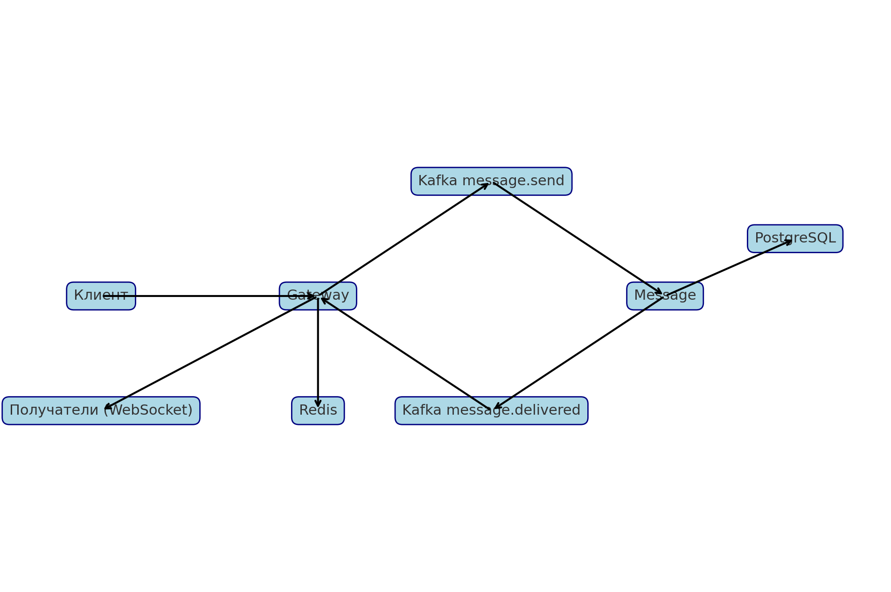

<h1 align="center">Messenger — Мессенджер на микросервисной архитектуре</h1>

<p align="center">
  <b>Go • Kafka • WebSocket • Redis • Docker • PostgreSQL</b>
</p>

<p align="center">
  
  
  
  
  
</p>

---

## 📌 Описание проекта

Данный проект представляет собой мессенджер в реальном времени, построенный на основе микросервисной архитектуры с асинхронной обработкой сообщений.

**Основные особенности:**
- Отправка сообщений через WebSocket
- Асинхронная обработка сообщений через Kafka
- Хранение WebSocket-сессий пользователей через Redis
- Микросервисная архитектура: каждый сервис выполняет свою функцию
- Полноценное масштабирование и отказоустойчивость

---

## 🔧 Используемый стек

- Go (Golang)
- Apache Kafka
- Redis
- PostgreSQL
- WebSocket
- Docker / Docker Compose
- JWT авторизация
- Swagger документация

---

## 📂 Структура микросервисов

- **Gateway** — точка входа, WebSocket-сервер, маршрутизация сообщений, Kafka клиент, Redis.
- **Auth** — сервис авторизации, регистрация пользователей, JWT.
- **User** — управление профилями пользователей.
- **Chat** — управление чатами и участниками.
- **Message** — приём и доставка сообщений, работа с Kafka, хранение в БД.

---

## 📊 Архитектурная схема

> 

---

## 🚀 Развёртывание проекта

### Сборка Docker-образов:

```bash
# Собрать все образы поочерёдно
cd gateway && docker build -t gateway .
cd ../auth && docker build -t auth-service .
cd ../user && docker build -t user-service .
cd ../chat && docker build -t chat-service .
cd ../message && docker build -t message-service .
```

### Запуск через docker-compose:

```bash
cd gateway
docker-compose up --build
```

---

## 🗄️ Работа топиков Kafka

- `message.send` — продюсер: Gateway, консьюмер: Message
- `message.delivered` — продюсер: Message, консьюмер: Gateway

---

## ⚙️ Основная логика работы

1. Пользователь подключается к WebSocket серверу.
2. Сообщение через Gateway уходит в Kafka (`message.send`).
3. Сервис Message сохраняет сообщение в БД и формирует события на каждого получателя (`message.delivered`).
4. Gateway получает события из Kafka и рассылает их через WebSocket подключённым клиентам.

---

## 📄 Документация API

- В каждом сервисе есть Swagger документация в папке `/docs`.
- Swagger можно открыть в редакторе: [Swagger Editor](https://editor.swagger.io/).

---

## 📬 Контакты разработчика

- Автор: Молоканов Алексей Александрович
- Telegram: [@bobr_lord](https://t.me/bobr_lord)

---

